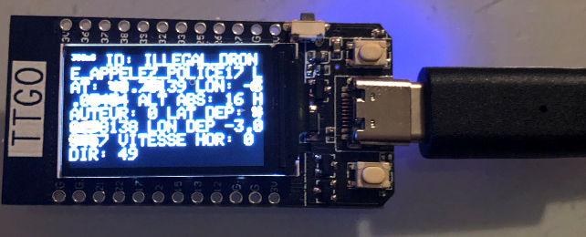

* Decode la trame beacon d'un balise, affiche le résultat sur le TFT d'une carte ESP32 TTGO-T-Display et sur le port série 
* Compilation avec une carte ESP32 Dev Module

### Préparation de la librairie

  1. Charger TFT_eSPI-master.zip depuis https://github.com/Bodmer/TFT_eSPI
  2. Copier TFT_eSPI sous libraries
  3. Dans le fichier libraries\TFT_eSPI\User_Setup_Select.h décommenter la ligne #include <User_Setups/Setup25_TTGO_T_Display.h>

## Mode d'emploi

Une pression sur le bouton en haut à droite augmente la temporisation d'affichage de +100 ms.

Une pression sur le bouton en bas à droite diminue la temporisation d'affichage de -100 ms.

La valeur de temporisation est affichée dans le coin en haut à gauche.
