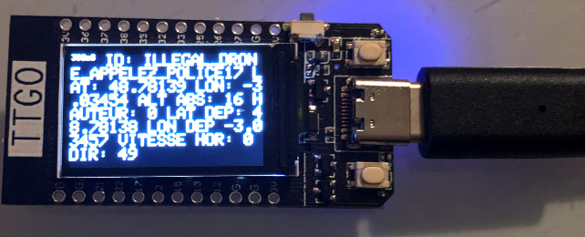
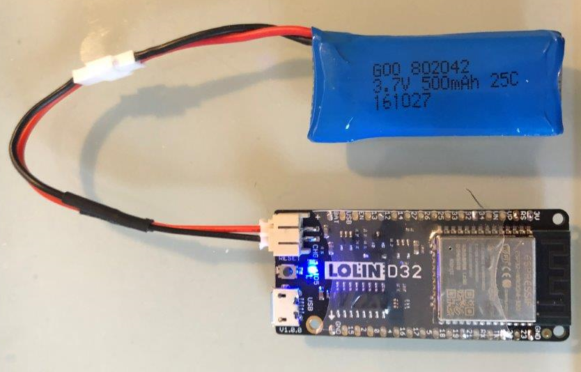
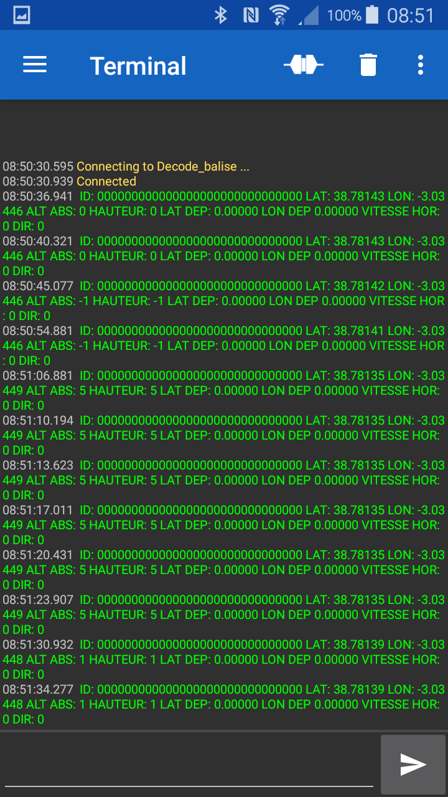

# Decode_Balise_ESP32_TFT

Durant la mise au point des balises, voici un outil bien pratique basé sur une carte TTGO T-Display ESP32 décrite ici http://www.lilygo.cn/prod_view.aspx?TypeId=50033&Id=1126&FId=t3:50033:3

# Decode_balise_ESP32

Décode la trame de la balise émise par un tracker GPS  : project https://github.com/khancyr/TTGO_T_BEAM et envoie le résultat à une console série via un cable OTG + https://play.google.com/store/apps/details?id=de.kai_morich.serial_usb_terminal) :
len=137 ID: ILLEGAL_DRONE_APPELEZ_POLICE17 LAT: 28.78126 LON: -3.03463 ALT ABS: 40 HAUTEUR: 48 LAT DEP: 28.78134 LON DEP: -3.03450 VITESSE HOR: 0 DIR: 1

Le code, dérivé de la version ESP8266 https://github.com/f5soh/decode_balise , est implémenté sur un ESP32 ce qui permet de décoder toute la trame .
Le code est basé sur https://github.com/ESP-EOS/ESP32-WiFi-Sniffer et https://github.com/justcallmekoko/ESP32Marauder/search?q=beaconSnifferCallback&unscoped_q=beaconSnifferCallback

On ajoutera l'URL https://dl.espressif.com/dl/package_esp32_index.json dans le Gestionnnaire de carte supplémentaire sous Fichier->Préférences->Paramètres

Dans Outils->Gestionnaire de carte: installer "esp32"

Choisir dans l'onglet Outils:
Type de carte: ESP32 Dev Module
Partition Scheme: No OTA (2MB APP/2MB SPIFFS)

## Hardware

# Decode_balise_ESP32_BT

Ajoute une sortie Bluetooth pour connecter une console de smartphone Android avec https://play.google.com/store/apps/details?id=de.kai_morich.serial_bluetooth_terminal&hl=en_US

Le taux de rafraichissement est réduit à 1 message toutes les 4s.

#### Settings -> Terminal 
* Font size : 10 
* Buffer size : Unlimited

#### Setting -> Misc.
* Macro buttons : None
* Keep screen on when connected : ON
